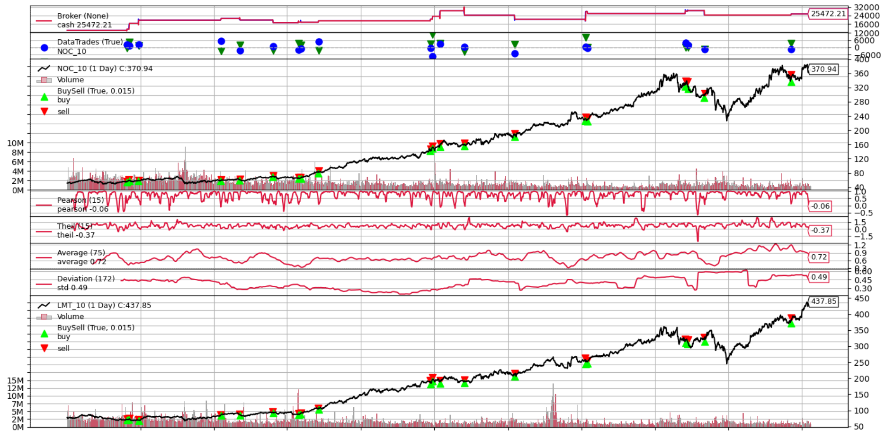

# This's a trading bot
This is a stock bot that looks at prices of 2 stocks and decides when to buy and sell each of them.
This strategy is based on  idea, that some stocks tend to maintain their correlation.  So betting against fluctuations of their correlaltion can generate profit.

## Math
To estimate correlation I've used running Theil and Pearson correlation coeffisients between prices of 2 stocks.
Theil(Y, X) estemates average ratio dY/dX. Order in which arguments are passed is important (Theil(Y, X) ≠ 1 / Theil(X, Y)) https://en.wikipedia.org/wiki/Theil%E2%80%93Sen_estimator \
Pearson estemates how strong correlation is. Ranges from -1 to 1, where 1 is exact positive correlation and -1 is exact negative. Doesn't depend on order of arguments https://en.wikipedia.org/wiki/Pearson_correlation_coefficient

## Stocks
I've chose daily prices of stocks of Northrop Grumman Corporation (NYSE:NOC) and Lockheed Martin (NYSE:LMT). They are top 3 and 1 suppliers of US army forces.
I didn't pick Boeng (#2 supplier) because it has big unrelated part of busines, whereas those two specialise on production for military.

## Used soft
Yahoo finance - data source\
Python 3.8.2 \
python libraries:
- scipy - Theil correlation
- numpy - Pearson correlation
- backtrader - backtasting and trading framework

## Opening trades
Let Theil coefficient = dPriceOf1/dPriceOf2

One stock is bouhgt and other is sold when:
1. Pearson coefficient is low enough
2. Theil coefficien crosses the upper (buy - 2, sell - 1) or lower bound (buy - 1, sell - 2)

Accounting Pearson coeff helps, because during moments, when correlation break, not only ratio between prices changes, but a that moment correlation also weakens.

тестовая картинка из файла с играми

Boundaries are calculated as average +- running standart deviation * parameter. This is an exact formula for Bollinger bands, though in my case i made period for running standart deviation 2 times bigger then one for an average, as it resylted in smoother lines and more predictable results.

Money for a whole trade is devided equally and each part is spent on buying/selling each stock, so balance of account stays unchanged.
Also it makes both stocks equally affect the outcome despite differences in price.
 

## Closing Trades

Trades close when:
1. Profit or loss are bigger then thresholds.
2. Theil coefficient crosses upper or lower boundaries.
3. It's the last day of used testing data

Boundaries are calculated as explained earlier.

## Results

Strategy results in average of 10% per year and sharpe coeffiscient ((average year percentage - zero risk percentage) / std deviation of portfolio) 0.38 which is considered very bad. On the graph below green and red triangles represent executed buy/sell orders. On the top graph red line - value of account.

## Concerns
1. All profit is geneerated during first 5 years ( данные для тех 5 лет ). Low sharpe coefficient as a consequence. My explanation for this is that at the same period when profit vanishes, std of Theil coefficent gets rough and wave-like. The same problem occured when I was initially testing on 20 years of data. On first 10 algorithm performed nice, then it was only loosing.
In machine learning this problem is usually fought with deviding learning and testing data. But with trading market appearance obviously changes, but it's hard to tell how fast and evaluate correct time range for trading. -- пофиксилось

2. Not many trades. 17 pduring 9 years. They also come in seqences of 4-5, so most of the time strategy remains unactive.

3. 
