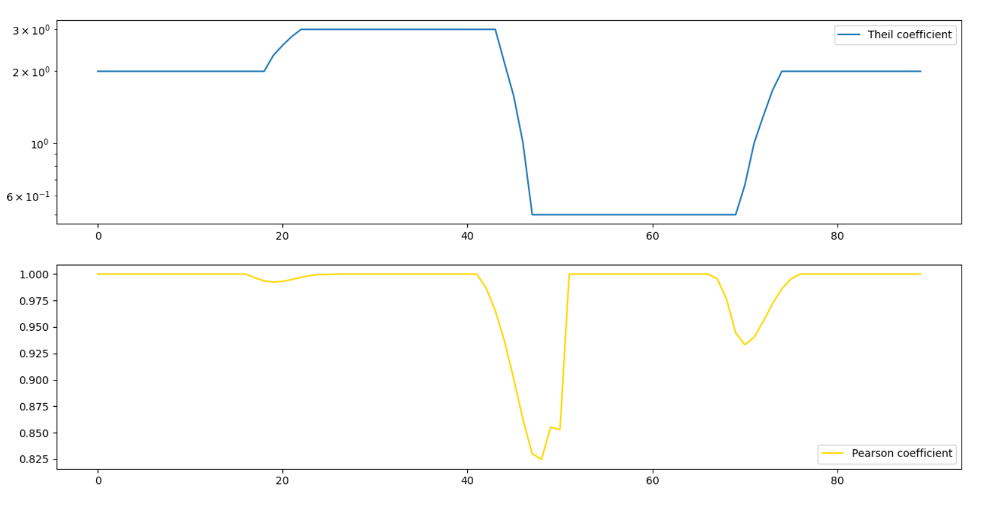

# This's a trading bot
This stock bot tracks prices of 2 assets and automaticly makes trading decisions.
That strategy is based on idea that some stocks tend to maintain their correlation. For example, close competitors or price of an asset  and corresponding industry player. Betting against fluctuations of correlation can generate profit.

## Math
Running Theil and Pearson correlation coefficients between prices of 2 stocks are used to estimate correlation. Let X, Y be the time series of 2 asset prices and w - length of the time frame. Theil(X, Y, w) estimates average ratio dY/dX over last w days. Please note: order in which arguments are passed is important (Theil(Y, X) ≠ 1 / Theil(X, Y)) https://en.wikipedia.org/wiki/Theil%E2%80%93Sen_estimator \
Pearson coefficient estimates correlation strength. It ranges from -1 to 1, where 1 is exact positive correlation and -1 is exact negative. Unlike Theil coefficient, Pearson coefficient is invariant to parameter order. https://en.wikipedia.org/wiki/Pearson_correlation_coefficient

## Stocks
For argorithm demonstration one can choose a pair of close competitors whose stock prices correlate. Results below are based on historical daily prices of Northrop Grumman Corporation (NYSE:NOC) and Lockheed Martin (NYSE:LMT) stock. They are top 3 and 1 suppliers of US army forces.
Boeing (#2 supplier) wasn't picked because it has big unrelated part of business, whereas other two specialize on production for military.

## Software tools
data source: Yahoo finance\
Python 3.8.2 \
python libraries:
- scipy - Theil correlation
- numpy - Pearson correlation
- backtrader - back testing and trading framework

## Opening trades
Let Theil coefficient = dPriceOf1/dPriceOf2

Pearson coefficient detects instances of weak correlation.

One stock is bought and other is sold when:
1. Pearson coefficient is low enough
2. Theil coefficient crosses the upper (buy - asset 2, sell - asset 1) or lower bound (buy - asset 1, sell - asset 2)

##### Blue line on the chart is Theil coef, yellow - Pearson calculated for 2 sample sets of data. Logarithmic scale is chosen for Theil coefficient for being "invariant" to changing every point y to 1/y. When Theil coefficient changes, Pearson coef decreases

Boundaries are calculated as average +- running standard deviation * parameter. This is an exact formula for Bollinger bands, though in in algorithm period for running standard deviation is twice as big as for an average. It makes smoother lines and more predictable results.

Money for a whole trade is divided equally and each part is spent on buying/selling each stock, so balance of account stays unchanged.
Also it makes both stocks equally affect the outcome despite differences in price.
 

## Closing Trades

Trades close when:
1. Profit or loss are bigger then thresholds.
2. Theil coefficient crosses upper or lower boundaries.
3. It's the last day of used testing data

Boundaries are calculated as explained above.

## Results

Strategy results in 218% for 9 years of test (annualized 9%) and Sharpe coefficient ((average year profit percentage - zero risk profit percentage) / std deviation of portfolio) 0.38 which is considered very bad (normally it's >1). On the graph below green and red triangles represent executed buy/sell orders. Red line on the top graph is value of account.

## Remarks
There aren't many trades - only 17. Also most of them are performed in sequences of 5-6 within 3-6 months. So most of the time there are no trades executed. It results in risk that exceeds normal by ~3 times for this yield (calculations are based on Sharpe coefficient).
